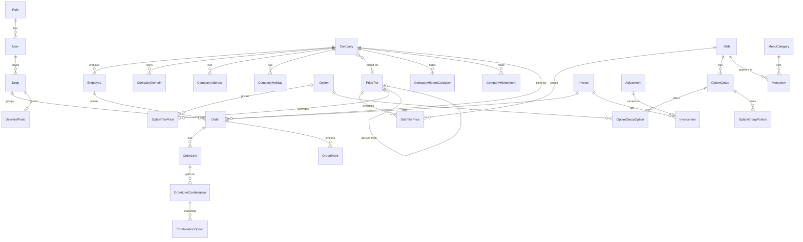

# PLAN.md: Fernleaf Kitchen Admin Panel

Status: **DRAFT v1, awaiting review** (see "Review resolutions" at the end; filled in by the reconcile step).
Spec: `docs/ASSIGNMENT.md`. Deadline: 4 Oct 2026, 11:59 PM IST. Stack: Next.js + NestJS + Prisma + PostgreSQL.
Priority: every [Must] fully working and deployed. Should/Could only after the cut line (section 17).

Conventions in this doc: **DB** = enforced by the database (constraint/index). **SVC** = enforced in a service (tested). Each decision: *chosen / rejected / why / risk*.

---

## 0. Spec traps (each one has a home in the design)

| # | Trap | Handling |
|---|---|---|
| 1 | Cut-off counts back **kitchen** working days/holidays only. Company calendar must NOT move it. | `cutoffAt()` takes only kitchen calendar (§6). |
| 2 | Company calendar still matters for the **delivery date itself** (non-working day / holiday = invalid). | Date validation step (§6). I also require the delivery date to be a kitchen working day (ambiguity A3). |
| 3 | Missing price ≠ $0. No per-dish fallback to the default tier: default is only used when the *company* has no tier. | Resolver returns `null`; null = not orderable and hidden (§4). Explicit dish price must be >0 (DB check). |
| 4 | Rounding: derived prices round **up** to the next 5 cents; $2.11 → $2.15. Float errors forbidden. | Integer-only `ceil(base*bps/50000)*5`: one rounding step from the exact rational (§4). |
| 5 | Combination quantities must sum **exactly** to the line quantity; every required group satisfied **per combination**; duplicate combinations must not exist. | Signature + unique(line, signature), SVC validator, tests (§6). |
| 6 | Past orders must never change when catalogue/prices/company/address change. | Snapshot names, prices, costs, address, lead minutes on the order (§6). Nothing on an order joins live prices. |
| 7 | Dishes are never hard-deleted. Same for options, tiers, categories used by orders. | `active` flags; no DELETE endpoints for those; FKs `onDelete: Restrict`. |
| 8 | "Finish without start records a start". `kitchenStartedAt` = **first** unit's start. `kitchenReadyAt` only when **all** units done. | One tx, order-row lock, `COALESCE` (§7). |
| 9 | READ COMMITTED trap: two txs finish the last two units; each sees the other's unit as unfinished; `kitchenReadyAt` never set. | `SELECT … FOR UPDATE` on the order row at the start of every unit tx, then re-count (§7). Integration test. |
| 10 | Planned times must follow a delivery-time change. | `planTimes()` is pure and is called from confirm and override (§7). |
| 11 | Drop = same company + same address + **exact** same time. 12:00 and 12:05 are different drops. | `unique(deliveryDate, companyId, addressId, deliveryTimeMin)` (§8). |
| 12 | Cut-off processing run twice must be safe; a placer racing the sweep must not be stranded. | Conditional `updateMany`, advisory lock, and the sweep also picks up any open order on an already-passed date (§6). |
| 13 | After cut-off only admin can edit/cancel. Hiding buttons is not security. | Permission `orders:override` checked in service + `locked` computed server-side. |
| 14 | Driver sees only their own drops: object-level scoping, not just role. | Service filters by `driverId` unless permission `deliveries:read_any` (§10). |
| 15 | Time zones: Postgres DATE → JS `Date` is UTC midnight; Vercel/Render run in UTC; `new Date('2026-10-05')` is UTC. | Dates are `'YYYY-MM-DD'` strings end-to-end; Luxon with the configured IANA zone; browser never computes today/cut-off (§3). |
| 16 | Reviewer opens the app up to 2 weeks later; "today" has moved. Static seed data is stale. | Time-relative seed + idempotent `ensureDemoFresh()` on boot, daily job, and login (§15). |
| 17 | Order on at most one invoice; invoiced orders can still be cancelled / found short. | `Order.invoiceId` single column (structural), money frozen after invoicing, changes become Adjustments (§9). |
| 18 | Moving an employee to another company changes their rules but must not rewrite history. | Order stores `companyId` snapshot; move blocked while Draft/Placed orders exist (§5, A7). |
| 19 | Email domains: unique across companies, public domains forbidden, case-insensitive. | `CompanyDomain.domain` PK (lowercased) + shared public-domain blocklist in zod (§2). |
| 20 | "Rejected" status is never defined in the spec. | Defined in §6 (admin-only, terminal, non-billable) and written into the README. |
| 21 | Company must have an **owner who is one of its employees** (chicken-and-egg). | `ownerEmployeeId` nullable at creation; set after first employee; validated `owner.companyId == company.id` (SVC). |
| 22 | Min order quantity applies to the dish line total, not per combination. | Validator checks `line.quantity >= minOrderQty`. |
| 23 | Employee flags (address/time/packaging) must be enforced on the server. | Validator rejects differing values with field errors; defaults forced otherwise (§6). |
| 24 | Money reconciliation: order total = Σ lines; invoice total = Σ items. | Totals computed once in a pure function, stored, asserted in tests; invoice total computed from items in the same tx. |
| 25 | Lint and type-check must be clean. | CI workflow + `pnpm lint && pnpm typecheck && pnpm test` as a gate. |

---

## 1. Architecture

**Repo:** pnpm monorepo.
```
apps/api        NestJS (modules per domain; src/domain = pure TS, no Nest/Prisma imports)
apps/web        Next.js App Router, client-heavy, NO server actions, no business logic
packages/shared zod schemas, enums, permission constants, money helpers, error codes, DTO types
prisma/         schema.prisma + migrations (owned by apps/api; one schema)
docs/           ASSIGNMENT.md, PLAN.md, PLAN_REVIEW.md, AGENTS.md at root
```
*Rejected:* two repos (types can't be shared; two histories to read). *Risk:* workspace build order. Mitigation: `shared` builds with `tsc` to `dist` (CJS), web uses `transpilePackages`, root script `pnpm -r build` in topological order.

**Hosting:** DB **Neon** Postgres (pooled `DATABASE_URL` + `DIRECT_URL` for migrations). API **Render** web service (free tier). Web **Vercel**.
- *Rejected:* Render Postgres free (expires). *Risk:* Render free sleeps after 15 min, cold start ~30-50 s. *Mitigation:* external pinger (UptimeRobot/cron-job.org every 5 min on `GET /health`), which also keeps the in-process cron alive; lazy sweeps as backup (§6); web shows a "waking server…" state on first slow request.
- **Prisma:** pin one major version (6.x) at scaffold time and never upgrade mid-build.
- **Migrations:** `prisma migrate deploy` in the Render start command. Partial unique indexes, CHECK constraints, and partial indexes go into hand-edited SQL migrations (`migrate dev --create-only`, then edit).
- **Auth across origins:** browser only ever talks to the Vercel origin. `next.config` `rewrites: /api/:path* → ${API_ORIGIN}/:path*`. API sets `httpOnly; Secure; SameSite=Lax; Path=/` JWT cookie (12 h). Because everything is same-origin there is no CORS. `trust proxy` on in API. *Rejected:* browser → API directly with `SameSite=None` (third-party cookie blocking, CORS).
- **CSRF:** SameSite=Lax + mutating routes require `Content-Type: application/json` or multipart and an `Origin` check in a global guard.
- **Env vars:** `DATABASE_URL, DIRECT_URL, JWT_SECRET, API_ORIGIN (web), CRON_SECRET (optional external trigger), NODE_ENV, PORT, SEED_ON_BOOT=true`.
- **Scheduler:** `@nestjs/schedule` cron `* * * * *` (cut-off sweep) and `5 0 * * *` in kitchen TZ (demo freshness). Both also callable lazily.
- **Security basics:** `bcryptjs` (pure JS, no native build failures on Render), `@nestjs/throttler` on `/auth/login`, helmet.

---

## 2. Prisma data model

### Enums
`Temperature{HOT,COLD}` · `Packaging{STANDARD,INSULATED,ECO}` · `OrderStatus{DRAFT,PLACED,CONFIRMED,DELIVERED,CANCELLED,REJECTED}` · `OrderSource{STAFF,DEMO}` · `TierDerivation{NONE,COST_FACTOR,TIER_FACTOR}` · `InvoiceStatus{ISSUED,PAID,VOID}` · `InvoiceItemKind{ORDER,ADJUSTMENT}` · `AdjustmentStatus{OPEN,INVOICED,WAIVED}` · `AdjustmentReason{CANCELLED_AFTER_INVOICE,SHORT_DELIVERY,MANUAL}` · `CutoffTrigger{CRON,LAZY,MANUAL}`.
*Packaging as an enum (not a table):* the spec's admin-managed lists are only allergens, tags, stations, portion sizes. Risk: adding a type needs a migration; accepted.

### Models (compact; all ids `String @id @default(cuid())` unless noted; all `createdAt/updatedAt`)

```prisma
// ---- access ----
Role        { key @unique, name, permissions String[], landingPath, dashboardKey, isSystem }
User        { email @unique (stored lowercase), name, passwordHash, roleId→Role, active }          // staff only
Setting     { key @id, value Json }                                                                // typed by zod registry (§14)
KitchenHoliday { date @db.Date @id, name }

// ---- reference data (admin-managed, deactivate never delete) ----
Allergen{name @unique,active}  DietaryTag{name @unique,active}
KitchenStation{name @unique,sortOrder,active}  PortionSize{name @unique,sortOrder,active}

// ---- catalogue ----
Dish        { sku @unique, name, description, imageUrl?, temperature, costCents Int, stationId?→KitchenStation,
              minOrderQty Int?, active Boolean }                         // CHECK costCents>=0, minOrderQty>=1
DishAllergen{dishId,allergenId} PK both    DishDietaryTag{dishId,tagId} PK both
Option      { name, costCents Int, active }       OptionAllergen / OptionDietaryTag (same shape)
OptionGroup { dishId→Dish, name, required Boolean, sortOrder Int, usesPortions Boolean }  @@index([dishId, sortOrder])
OptionGroupOption { groupId, optionId, sortOrder }  PK(groupId,optionId)
OptionGroupPortion{ groupId, portionSizeId, extraCents Int, sortOrder }  PK(groupId,portionSizeId)   // rows only if usesPortions
OptionPortionSupport{ optionId, portionSizeId }  PK both        // "every option in a portioned group supports every group size" (SVC on save)

// ---- pricing ----
PriceTier   { name @unique, isDefault Boolean, derivation TierDerivation, baseTierId?→PriceTier, factorBps Int?, active }
   // DB: partial UNIQUE (isDefault) WHERE isDefault   → exactly ≤1 default; SVC ensures ≥1
   // DB CHECK: NONE ⇒ base NULL & factor NULL ; COST_FACTOR ⇒ base NULL & factor>0 ; TIER_FACTOR ⇒ base NOT NULL & base<>id & factor>0
DishTierPrice  { dishId, tierId, priceCents Int }  PK(dishId,tierId)   // CHECK priceCents>0.  A row = explicit override.
OptionTierPrice{ optionId, tierId, priceCents Int }  PK(optionId,tierId) // CHECK priceCents>=0

// ---- menu ----
MenuCategory{ name, slug @unique, sortOrder, active, isSecret }
MenuItem    { categoryId, dishId, sortOrder, active }  @@unique([categoryId,dishId])   // dish may be in several categories
CompanyHiddenCategory{ companyId, categoryId } PK both       CompanyHiddenItem{ companyId, menuItemId } PK both

// ---- companies & employees ----
Company { name @unique, tierId?→PriceTier, ownerEmployeeId? (nullable, SVC-validated), workingDays Int[] default [1..5] (ISO 1=Mon),
          defaultDeliveryMin Int, dispatchLeadMinutes Int default 60, defaultPackaging Packaging, driverNotes?, defaultDriverId?→User,
          billingName, billingEmail, billingPhone?, billingAddress, active }
CompanyDomain { domain @id (lowercase), companyId }                    // DB: global uniqueness; public blocklist in zod/SVC
CompanyAddress{ companyId, label, line1, line2?, city, state?, postcode, isDefault, active }  // DB: partial UNIQUE(companyId) WHERE isDefault
CompanyHoliday{ companyId, date @db.Date, name }  @@unique([companyId,date])
Employee{ companyId, name, email @unique, phone?, canChooseAddress, canChangeTime, canChangePackaging, active }
EmployeeAllergen{employeeId,allergenId} EmployeeDietaryTag{employeeId,tagId}

// ---- orders ----
Order {
  number Int @unique @default(autoincrement()), employeeId, companyId (snapshot FK, billed company),
  deliveryDate @db.Date, deliveryTimeMin Int (0..1439), addressId, addressSnapshot Json, packaging,
  status OrderStatus, source OrderSource default STAFF, version Int default 0,
  draftPayload Json?,                       // only while DRAFT (§6)
  totalCents Int, leadMinutes Int, notes?, cancelReason?, rejectReason?, allergenAckById?,
  plannedKitchenReadyAt?, plannedDispatchReadyAt? (timestamptz),
  placedAt?, confirmedAt?, kitchenStartedAt?, kitchenReadyAt?, dispatchReadyAt?, outForDeliveryAt?, deliveredAt?, cancelledAt?, rejectedAt?,
  dropId?→Drop, invoiceId?→Invoice, createdById→User
}
// idx: (deliveryDate,status) · (companyId,deliveryDate) · (employeeId) · (dropId) · (invoiceId)
//      partial (companyId) WHERE status IN ('CONFIRMED','DELIVERED') AND invoiceId IS NULL   // unbilled lookup
// CHECK totalCents>=0
OrderLine { orderId, dishId, dishName, dishSku, quantity, dishPriceCents, dishCostCents, tierName, lineTotalCents, sortOrder }
   // UNIQUE(orderId,dishId) (one line per dish; merge combos instead)   CHECK quantity>0
OrderLineCombination {                       // = the kitchen PREP UNIT
  orderLineId, signature, label, quantity, unitCents, unitCostCents, totalCents, sortOrder,
  startedAt?, doneAt?, startedById?, doneById?
}  // UNIQUE(orderLineId,signature) · CHECK quantity>0 · CHECK totalCents=unitCents*quantity
   // CHECK doneAt IS NULL OR startedAt IS NOT NULL · partial idx (orderLineId) WHERE doneAt IS NULL
CombinationOption { combinationId, groupId?, groupName, optionId?, optionName, portionName?, optionCents, portionExtraCents, optionCostCents }
OrderEvent { orderId, type, at, actorUserId?, data Json }     // timeline (not an audit log): PLACED, EDITED, CONFIRMED, KITCHEN_STARTED, ... idx (orderId,at)

// ---- dispatch ----
Drop { deliveryDate @db.Date, companyId, addressId, deliveryTimeMin, driverId?→User,
       outForDeliveryAt?, deliveredAt?, deliveredNote?, deliveredById?, onTime Boolean? }
   // UNIQUE(deliveryDate,companyId,addressId,deliveryTimeMin) · idx(deliveryDate,driverId)
DeliveryPhoto { dropId @unique, mime, size Int, data Bytes }

// ---- billing ----
Invoice { number @unique (INV-000123), companyId, status, totalCents, issuedAt, paidAt?, voidedAt?, voidReason?, createdById }
InvoiceItem { invoiceId, kind, orderId?, adjustmentId? @unique, description, amountCents Int }   // amount snapshot; signed for adjustments
Adjustment { companyId, orderId, reason, amountCents Int (signed, ≠0), status AdjustmentStatus default OPEN, note, createdById }

// ---- ops ----
CutoffRun { deliveryDate, trigger, forced Boolean, startedAt, finishedAt?, confirmedCount, cancelledCount, actorId? }
```

### ERD


**DB-enforced vs SVC:** DB: default-tier uniqueness, derivation shape, price > 0, domain uniqueness, one-default-address, line/signature uniqueness, drop uniqueness, `done ⇒ started`, `total = unit × qty`, `Order.invoiceId` single column, FK `Restrict`. SVC (because they span rows or settings): combination sum = line qty, required groups, portions consistency, calendar rules, cut-off, tier cycle check, owner∈company, line total = Σ combos, order total = Σ lines.

---

## 3. Money and time conventions

- **Money:** integer cents everywhere (DB `Int`, TS `number` integers). Never `Decimal`, never `parseFloat`. `shared/money.ts`: `parseMoneyToCents(string)`, `formatCents(c)`, `mulBps`, `roundUp5`. UI inputs convert string→cents at the boundary. Max values bounded by zod (≤ 100,000,000 cents) so JS numbers stay exact.
- **Dates:** delivery date is `DATE` in the DB and the string `'YYYY-MM-DD'` in all code and API payloads. `shared/dates.ts`: `dbDateToString(d) = d.toISOString().slice(0,10)`, `stringToDbDate(s) = new Date(s+'T00:00:00Z')`. Never format a DB date via local time.
- **Times of day:** `deliveryTimeMin` = minutes since midnight in kitchen TZ (Int 0-1439, 5-min steps enforced by zod). `HH:mm` only at the UI edge.
- **Instants:** `timestamptz`. Computed in Luxon from (date, minutes, IANA zone).
- **Time zone:** one kitchen zone, setting `timezone`, default **`Asia/Kolkata`** (kitchen assumed in India; reviewers and the author are IST; no DST so no ambiguity, but Luxon handles DST if changed). Stated in README.
- **"Today":** `Clock.todayStr() = DateTime.now().setZone(tz).toISODate()`. A `Clock` interface is injected so tests can fix time. The web reads `GET /meta` → `{ today, nowIso, timezone }`; **the frontend never computes today, cut-offs, locked flags, lateness**. The server returns `cutoffAt`, `locked`, `late`, `atRisk`.
- Display in the browser: format server-supplied instants with `Intl` in the *kitchen* zone (pass `timeZone`), not the browser's.

---

## 4. Pricing engine

**Model:** tier row stores *how* to derive; `DishTierPrice`/`OptionTierPrice` rows store explicit overrides. Resolution is computed, never materialised (no stale derived data; a base-tier change propagates instantly to all derived tiers). Scale: ≤ ~100 dishes × ≤ ~5 tiers: trivial to compute per request.

```ts
// packages/shared/pricing.ts  (pure)
derive(baseCents, factorBps) = ceil(baseCents * factorBps / 50000) * 5      // single rounding of the exact value; $2.11 → 215; 100×2.4 → 240; 1000+15% → 1150
// factorBps: 10000 = ×1.00.  "cost × 2.4" → 24000.  "Standard +15%" → 11500.  Integer math; products < 2^53.

resolveDish(dish, tierId, ctx):                           // ctx: tiersById, dishOverrides Map<"dishId:tierId",cents>, memo
  if memo has (dish,tierId) return it
  ov = ctx.dishOverrides.get(dish.id, tierId); if ov != undefined → return ov      // explicit wins, as typed (no rounding)
  t = ctx.tiersById[tierId]
  p = match t.derivation:
        NONE         → null
        COST_FACTOR  → derive(dish.costCents, t.factorBps)
        TIER_FACTOR  → b = resolveDish(dish, t.baseTierId, ctx); b == null ? null : derive(b, t.factorBps)
  return (p != null && p > 0) ? p : null                // zero is "no price", never shown as $0

resolveOption(opt, tierId, ctx): same shape but results ≥ 0 are valid ($0 surcharge option is legitimate)
effectiveTierId(company, defaultTier) = company.tierId ?? defaultTier.id
```
- **Cycle prevention:** on tier save, walk `baseTierId` chain from the proposed base; if it reaches the tier being saved → `422 TIER_CYCLE`. Depth cap 8. DB CHECK blocks `base = self`.
- **No fallback to the default tier per dish**: only when the *company* has no tier. A dish unpriced on the company's tier is invisible.
- **Bulk resolution without N+1:** `PricingService.loadContext(tierIds)` does 3 queries (tiers, all dish overrides for tiers in the chain, all option overrides) then pure resolution in memory. Menu resolve loads once per request.
- **Tier grid:** `GET /pricing/tiers/:id/grid?kind=dish|option&missing=true&q=&page=` → rows `{ id, name, sku, costCents, overrideCents|null, derivedCents|null, effectiveCents|null, source: 'OVERRIDE'|'DERIVED'|'NONE' }`. `PUT /pricing/tiers/:id/grid` takes a batch `[{id, priceCents|null}]` (null removes override); UI is an inline-editable table that saves on blur in batches; "Missing price" toggle filters `effectiveCents == null`. Header shows counts of unpriced dishes.
- **Option prices follow the same rules.** An option with no price on the tier is **unavailable on that tier's menu**. If a **required group has zero available options**, the dish is **unorderable** and hidden (staff preview in "debug" mode lists it with the reason). If an optional group has none, the group is omitted.
- **Portion extras** (`OptionGroupPortion.extraCents`) are flat, tier-independent (A9).
- **Price changes** affect only new orders/new placements (§6 snapshots). Placed orders keep their snapshot; editing a Placed order re-prices (A10).

---

## 5. Menu resolution (single service: `MenuService.resolveForEmployee(employeeId, {slug?, debug?})`)
Used by the preview endpoint **and** by the order validator, so what staff preview is exactly what the server accepts.

Rules in precedence order (all must hold for a dish to be orderable through a given MenuItem path):
1. Employee `active`, company `active`.
2. `Dish.active`.
3. `MenuItem.active`.
4. `MenuCategory.active`.
5. Category not in `CompanyHiddenCategory(company)`; `MenuItem` not in `CompanyHiddenItem(company)`.
6. `resolveDish(dish, companyTier) != null`.
7. Option availability: each group keeps only options that are `active`, priced on the tier, and (if `usesPortions`) support all the group's sizes; required group with 0 options ⇒ dish unorderable.
8. **Secret category:** excluded from the *listing*. Still reachable by slug (`?slug=chefs-table`; the order builder has an "open secret category by code" field) and its dishes are orderable. This is the interpretation of "not listed but can still be reached" (A5).

A dish in several categories is orderable if **≥1 path** passes. The menu returns per dish: `priceCents`, `allergens`, `dietaryTags`, option groups with prices and portion sizes, `allergenConflicts[]` (dish or option allergens ∩ employee allergies) and `dietaryMismatch[]`.
**Allergens:** *warn, then require acknowledgement.* Place with conflicting combos and no `acknowledgeAllergens: true` → `422 ALLERGEN_ACK_REQUIRED` (lists conflicts). Ack is stored (`allergenAckById`). Dietary preference mismatch is a non-blocking warning. *Rejected:* hard block (staff may order for a person who removes the item, e.g. picks it off) and silent allow (unsafe).
Preview endpoint: `GET /menu/preview?employeeId=&slug=&debug=`. Debug adds hidden dishes with reasons ("hidden: category hidden for company", "no price on tier Partner", "required group 'Protein' has no priced options").

---

## 6. Orders

### 6.1 Draft vs Placed storage (decision)
- **DRAFT** = header (employee, date) + `draftPayload` JSON (raw lines/combos/selections/delivery choices) validated **structurally only** (zod). No price snapshot, no OrderLine rows. Staff can save half-built orders; there is nothing stale to re-price.
- **PLACED/CONFIRMED/...** = fully validated, normalised, snapshotted rows.
- `Place` = validate payload fully → materialise rows → status PLACED (conditional on `status=DRAFT AND version=:v`).
- *Rejected:* normalised drafts with relaxed validation (two validation levels, stale prices). *Risk:* two representations; contained in `OrderBuilder` (payload ↔ rows round-trip tested).

### 6.2 Server-side validation pipeline (single `OrderValidator`, pure + loaded context, used by preview, place, and edit)
1. **Actor/permission** (`orders:write`; `orders:override` for locked/override paths).
2. **Employee** exists, active; load company, tier, calendars, settings.
3. **Delivery date:** well-formed; `>= today`; company working day; not a company holiday; **kitchen working day and not a kitchen holiday**; **not locked** (`now < cutoffAt(date)`) unless caller has `orders:override` and it is an admin edit of a Placed/Draft order (late *create* is blocked for everyone in v1, optional later; see §17).
4. **Delivery details:** address ∈ company active addresses; time 0..1439 step 5. If `!canChooseAddress`: value must be absent or equal the company default address → else `FIELD_NOT_ALLOWED`; same for time (`canChangeTime`) and packaging (`canChangePackaging`); absent = company defaults.
5. **Lines (≥1 to place):** one line per dish (duplicate dish → error). Each dish must be orderable for this employee (MenuService, §5). `line.quantity >= dish.minOrderQty`.
6. **Combinations per line:** ≥1; each `quantity` integer ≥1; **Σ combination quantity == line quantity**; per combination, per group: ≤1 selection (single-choice, §A8), required ⇒ exactly 1, option ∈ group's *available* options, `portionSizeId` present **iff** group `usesPortions` and valid for the group; unknown groups rejected. **Signature** = sorted `groupId:optionId[:portionId]` joined; duplicate signatures within a line → error (merge them).
7. **Pricing:** `unit = dishPrice + Σ(optionPrice + portionExtra)`; `combo.total = unit × qty`; `line.total = Σ combo.total`; `order.total = Σ line.total`. Pure function `priceOrder()`; asserts invariants.
8. **Allergen acknowledgement** (§5).
9. **Persist** in one tx with snapshots: `dishName/Sku/price/cost`, `tierName`, `label` (e.g. "Paneer · Brown rice (Large)"), `CombinationOption` names/prices/costs/portion, `addressSnapshot`, `leadMinutes` (company value at placement). `OrderEvent PLACED`.
Errors use path-keyed field errors (`lines.0.combinations.1.selections.g_protein`) so the form can highlight the exact input.

**Price preview:** `POST /orders/preview` runs steps 2-8 without persisting and returns breakdown + all errors (not just the first). The builder calls it on change (debounced). The totals shown are what the server will charge.

### 6.3 Status transitions (permission `orders:write` unless stated; "admin" = `orders:override`)
| From → To | Who/when | Notes |
|---|---|---|
| (new) → DRAFT | staff, before cut-off | JSON payload |
| DRAFT → PLACED | staff, before cut-off | full validation + snapshot |
| DRAFT/PLACED → edited | staff before cut-off; admin any time while still DRAFT/PLACED | `PUT` with `version`; Placed edit replaces rows and **re-prices** (A10); bump `version`; event |
| DRAFT/PLACED → CANCELLED | staff before cut-off; admin any time | reason optional |
| PLACED → CONFIRMED | **cut-off processing only** | sets confirmedAt, planned times, drop |
| DRAFT → CANCELLED | cut-off processing | |
| PLACED/CONFIRMED → REJECTED | admin only, reason required | **Rejected = the kitchen/admin refuses or cannot fulfil**; terminal; not billable; if invoiced → adjustment (§9) |
| CONFIRMED → CANCELLED | admin only | terminal; not billable; if invoiced → adjustment |
| CONFIRMED → DELIVERED | via drop delivery (driver) or admin force | sets `deliveredAt` |
| Any terminal → anything | never | |
Every transition = conditional `UPDATE … WHERE id=? AND status=:expected [AND version=:v]`, `count==0 ⇒ 409`.
**Confirmed orders' line items are not editable** (A11): cancel/reject and re-create instead. Admin overrides on CONFIRMED: **delivery time, address, packaging** only, while `outForDeliveryAt IS NULL`.

### 6.4 Cut-off algorithm (pure, `domain/cutoff.ts`)
```ts
cutoffAt(deliveryDate: 'YYYY-MM-DD', s: {tz, workingDays:Set<1..7>, holidays:Set<string>, cutoffTime:'HH:mm', cutoffDays:number}): Instant
  d = deliveryDate; n = 0
  while n < s.cutoffDays:
     d = d - 1 day
     if isWorkingDay(d) && !s.holidays.has(d): n++        // kitchen calendar ONLY
     guard: iterations < 400 else throw (settings validation guarantees ≥1 working day)
  return DateTime.fromISO(d + 'T' + s.cutoffTime, {zone: s.tz})
isLocked(date, now) = now >= cutoffAt(date)               // equal ⇒ locked
```
**Edge-case table** (kitchen Mon-Fri, cutoff 16:00 IST unless stated; Oct 2026: 5=Mon … 9=Fri, 12=Mon):
| # | Case | Result |
|---|---|---|
| 1 | Wed 7th, N=2 | Mon 5th 16:00 (spec example) |
| 2 | Mon 12th, N=2 | Thu 8th 16:00 (skip Sat/Sun; Fri=1, Thu=2) |
| 3 | Mon 12th, N=2, kitchen holiday Fri 9th | Wed 7th 16:00 |
| 4 | Tue 13th, N=1 | Mon 12th 16:00 |
| 5 | Mon 12th, N=1 | Fri 9th 16:00 |
| 6 | Mon 12th, N=1, holiday Fri 9th | Thu 8th 16:00 |
| 7 | Wed 7th, N=0 | Wed 7th 16:00 (same day) |
| 8 | Thu 8th, N=3 | Mon 5th 16:00 |
| 9 | Tue 13th, N=3 | Thu 8th 16:00 (Mon,Fri,Thu) |
| 10 | Wed 7th, N=2, holidays Mon 5 + Tue 6 | Thu 1st 16:00 |
| 11 | Delivery Fri 9th, N=1, **company** holiday Thu 8th only | Thu 8th 16:00 (company calendar ignored) |
| 12 | Sat 10th as delivery date | rejected: kitchen not working (field error `deliveryDate`) |
| 13 | Kitchen works Sat (Mon-Sat), Mon 12th, N=1 | Sat 10th 16:00 |
| 14 | `now == cutoffAt` exactly | locked |
| 15 | cutoffTime `00:00`, Tue, N=1 | Mon 00:00 |
| 16 | Different `tz` setting (e.g. America/New_York) | same date logic, instant differs; tests pass a tz |

### 6.5 Cut-off processing (idempotent, safe under races)
`CutoffService.processDate(date, {trigger, force, actor})`:
1. `pg_try_advisory_lock(hash('cutoff'))` (session lock); if not acquired return `{skipped:true}`.
2. If `!force && now < cutoffAt(date)` → `409 CUTOFF_NOT_REACHED` (manual) / no-op (cron).
3. One tx:
   - `UPDATE Order SET status='CANCELLED', cancelReason='cut-off: draft', cancelledAt=now WHERE deliveryDate=:d AND status='DRAFT'`; count → `cancelledCount`; `OrderEvent` createMany.
   - `SELECT id … WHERE deliveryDate=:d AND status='PLACED' FOR UPDATE`; group by `(companyId, addressId, deliveryTimeMin)` → upsert Drop (driver defaults to company `defaultDriverId` on create); per order `UPDATE … SET status='CONFIRMED', confirmedAt, dropId, plannedDispatchReadyAt, plannedKitchenReadyAt WHERE id AND status='PLACED'`; `OrderEvent CONFIRMED`.
   - `CutoffRun` row.
4. **Second run:** both `WHERE status` filters match 0 rows → `{confirmed:0,cancelled:0}`; harmless.
- **Sweep** (cron every minute + lazy on boot + lazy at most once/30 s on board/list/dashboard reads): `SELECT DISTINCT deliveryDate FROM Order WHERE status IN ('DRAFT','PLACED') AND deliveryDate <= today+horizon`; for each date where `now >= cutoffAt` and date ∉ `cutoffHoldDates` → `processDate`. **Self-healing:** an order placed in the race window right at cut-off is picked up next minute.
- **Not revalidated at cut-off:** per the spec every Placed order is confirmed. Snapshots keep it valid even if the dish was later deactivated or hidden. Deactivating a dish with open Placed orders shows a warning with the count (A12).
- **Manual trigger:** `POST /cutoff/run {date, force?}`: permission `cutoff:run` (admin). Without `force`, requires the cut-off to have passed. `force` (demo tool) allows a future date and is labelled as such in UI/README.
- **`cutoffHoldDates` setting** (demo tool): sweep skips listed dates so the seed can leave a locked date unprocessed for reviewers to trigger manually. Visible/editable in Settings; README explains.
- **Planned times (pure `planTimes(date, timeMin, leadMin, bufferMin=30, tz)`):** `deliveryInstant`; `plannedDispatchReadyAt = deliveryInstant − leadMin`; `plannedKitchenReadyAt = plannedDispatchReadyAt − bufferMin`.

### 6.6 List / detail
- `GET /orders?from&to&status[]&companyId&invoiced=true|false&q&page&pageSize(≤100)&sort`. `q` = ILIKE on employee name/email, company name, or exact order number. Returns `{items,total,page,pageSize}`; items include `cutoffAt`, `locked`, `invoiceNumber`.
- Detail: lines → combinations → options, money breakdown, delivery (snapshot), `locked`, available actions (server-computed from permissions + state), and `events[]` timeline.

---

## 7. Kitchen

- **Prep unit = `OrderLineCombination`** (one row per distinct combination; quantity = number of meals). Only units of **CONFIRMED** orders appear.
- **Station routing:** *live*, via `Dish.stationId` (join at read time). Station is operational, not financial; if a lead reassigns a dish to another station, unfinished work should move with it. Null → "Unassigned". *Rejected:* snapshotting station (stale routing).
- **State machine per unit:** `NOT_STARTED → STARTED → DONE`; `NOT_STARTED → DONE` allowed (records start = done time). Start twice → `409 ALREADY_STARTED`; done twice → `409 ALREADY_DONE`. No undo in v1.
- **Concurrency (the READ COMMITTED trap):**
```ts
$transaction(async tx => {
  const o = await tx.$queryRaw`SELECT id,status FROM "Order" WHERE id=${orderId} FOR UPDATE`   // serialises every unit/cancel/override op on this order
  if (o.status !== 'CONFIRMED') throw 409 ORDER_NOT_WORKABLE
  // start:
  n = UPDATE unit SET startedAt=:now, startedById=:u WHERE id=:unit AND startedAt IS NULL;  n==0 → 409 ALREADY_STARTED
  // done:
  n = UPDATE unit SET startedAt=COALESCE(startedAt,:now), doneAt=:now, doneById=:u WHERE id=:unit AND doneAt IS NULL; n==0 → 409 ALREADY_DONE
  UPDATE "Order" SET kitchenStartedAt = COALESCE(kitchenStartedAt, :now) WHERE id=:o            // first writer = first unit's start
  UPDATE "Order" SET kitchenReadyAt=:now, version=version WHERE id=:o AND kitchenReadyAt IS NULL
     AND NOT EXISTS (SELECT 1 FROM "OrderLineCombination" c JOIN "OrderLine" l ON l.id=c."orderLineId" WHERE l."orderId"=:o AND c."doneAt" IS NULL)
  insert OrderEvent (KITCHEN_STARTED once, KITCHEN_READY once)
})
```
After the lock is granted, the second tx's next statement takes a fresh snapshot (READ COMMITTED), sees the first tx's committed unit, and the `NOT EXISTS` is correct. **Required integration test:** two parallel `done` calls on the last two units ⇒ `kitchenReadyAt` set exactly once.
Cancel/reject/override take the same order-row lock.
- **Force-complete (admin, `kitchen:force`):** same tx; sets `startedAt` on unstarted units and `doneAt` on unfinished units, sets order started/ready. Event `FORCE_COMPLETED`.
- **Late / at risk (settings):** for CONFIRMED orders with `kitchenReadyAt IS NULL`:
  - `LATE` = `now > plannedKitchenReadyAt`.
  - `AT_RISK` = not late, and `plannedKitchenReadyAt − now <= atRiskWindowMinutes` (default 60), and the order has ≥1 unit not yet started.
  - Ready orders are never late/at-risk. Units inherit the status of their order.
- **Board query (400 orders):** `GET /kitchen/board?date&stationId` → **one** SQL/Prisma query selecting only needed columns: units joined to order (status CONFIRMED, date), line (dishName, quantity), dish (stationId), station (name). `label` snapshot avoids joining `CombinationOption`. DTO: `{ stations:[{id,name,remainingMeals,doneMeals}], orders:[{id,number,company,plannedKitchenReadyAt,risk,units:[{id,dish,label,qty,state,stationId}]}], cookTotals:[{dish,label,station,totalQty,doneQty}] }`. `cookTotals` computed in SQL `GROUP BY dishId, signature` (identical signatures across orders cook together). Indexes: `(deliveryDate,status)` on Order, `orderId` on line, `orderLineId` on unit, partial on `doneAt IS NULL`. Expected ~2-3k unit rows: sub-100 ms query, <300 KB gz. Client polls every 15 s (paused when tab hidden); each action returns the updated order and invalidates the query. Late/at-risk orders are sorted first, with red/amber banding; a header counter shows "N late · M at risk".
- **Station filter** is a query param; kitchen leads can also pick "All".

---

## 8. Dispatch and driver

- **Drop = entity** (not derived): needed to hold driver, delivery note/photo/on-time. Created at confirmation (and on override re-keying). `unique(deliveryDate,companyId,addressId,deliveryTimeMin)`; orders point to it (`Order.dropId`). A drop is *active* if it has ≥1 order in CONFIRMED/DELIVERED.
- **Fulfilment stage of an order** (derived from timestamps; no extra status enum): `PREPARING` (confirmed, no `kitchenReadyAt`) → `KITCHEN_READY` → `DISPATCH_READY` → `OUT_FOR_DELIVERY` → `DELIVERED`. The *drop's* stage = the **least advanced** active order.
- **Transitions are drop-level ("handled together")**, each requires the previous stage for **all** active orders in the drop, cannot repeat:
  1. `POST /drops/:id/dispatch-ready` needs all orders `kitchenReadyAt`. (409 `PREREQUISITE_NOT_MET` listing the orders still cooking.)
  2. `POST /drops/:id/assign-driver {driverId}`: allowed until delivered; default = company default driver at drop creation.
  3. `POST /drops/:id/out-for-delivery` needs dispatch-ready, **driver assigned**.
  4. `POST /drops/:id/deliver` (driver; multipart: `note?`, `photo?`) needs out-for-delivery.
  Implementation: tx; `SELECT … FROM "Drop" WHERE id FOR UPDATE`; conditional bulk `UPDATE "Order" SET <ts>=now WHERE dropId=:d AND status='CONFIRMED' AND <prev> IS NOT NULL AND <this> IS NULL`; affected rows must equal the active order count else 409. Delivered: orders → DELIVERED + `deliveredAt`; drop gets `deliveredAt/note/onTime/deliveredById`.
- **On-time:** `onTime = deliveredAt <= deliveryInstant + onTimeGraceMinutes` (setting, default 10). Stored at delivery, never recomputed.
- **Admin override of time/address after confirmation:** same tx as the order lock: update order, recompute planned times with the order's stored `leadMinutes`, **re-key the drop** (`find-or-create` target drop; move order; if the source drop has no active orders left and wasn't out/delivered, delete it). Blocked (409) once `outForDeliveryAt` is set. The order keeps its own `kitchenReadyAt/dispatchReadyAt`; if the moved order lands in a drop that is already further along, the drop-stage rule (least advanced) shows it truthfully. Driver comes from the target drop (company default for a new drop).
- **Cancelled order inside a drop:** simply excluded from the drop's active set; if the drop is out for delivery it continues with the rest; if it empties, it disappears from boards.
- **Photo:** client-side canvas resize (max 1280 px, JPEG q≈0.7, <1 MB), multipart to API, stored in `DeliveryPhoto.data` (Postgres bytea; survives ephemeral disks; ~100-300 KB each fits Neon free tier). Served via `GET /drops/:id/photo` with auth; *Rejected:* object storage (extra account/keys/time).
- **Driver data scoping:** `GET /driver/drops` returns drops where `driverId = me.id AND deliveryDate = today` sorted by `deliveryTimeMin`. DTO is minimal: company, address, `driverNotes`, order count, meals count, stage, note, delivered flag. No prices, no employee PII beyond the first names the driver needs to hand over boxes (optional). Deliver endpoint verifies ownership unless `deliveries:deliver_any`.
- **Driver UI (phone-first):** single column cards, big tap targets, sticky bottom action button per state ("Waiting for dispatch" disabled → "Mark delivered"), `tel:`/maps links, native camera input (`accept="image/*" capture="environment"`), offline toast on failure with retry; 16 px+ text.

---

## 9. Billing

- **Billable** = `status IN ('CONFIRMED','DELIVERED') AND invoiceId IS NULL`. Cancelled/Rejected/Draft/Placed never billable.
- **One invoice per order (structural):** `Order.invoiceId` is a single nullable column. Creating an invoice: tx →
  `UPDATE "Order" SET invoiceId=:inv WHERE id IN (:ids) AND companyId=:c AND invoiceId IS NULL AND status IN (CONFIRMED,DELIVERED)`; `count != ids.length` ⇒ rollback `409 ORDER_NOT_BILLABLE {conflicting ids}`. Then `InvoiceItem(kind=ORDER, amountCents=order.totalCents)` per order; selected OPEN adjustments become `InvoiceItem(kind=ADJUSTMENT, adjustmentId)` and flip to INVOICED; `Invoice.totalCents = Σ items` computed in the same tx (pure `invoiceTotal(items)`, asserted). Invoice number from a Postgres sequence.
- **Statuses:** `ISSUED → PAID`; `ISSUED → VOID` (not allowed once PAID). **Void** releases orders (`invoiceId = NULL`), items kept as history, adjustments carried on this invoice return to OPEN, and OPEN adjustments about orders on this invoice become WAIVED (the order itself is re-billed at its current state, so credits would double count). Invoice list shows paid/void filters.
- **Money on invoiced orders is frozen.** Policy for changes after invoicing (documented in README):
  | Change | Policy |
  |---|---|
  | Admin cancels/rejects an **invoiced** order | Status changes; invoice untouched; creates `Adjustment(−order.totalCents, CANCELLED_AFTER_INVOICE, OPEN)` for the company; staff include it (default-selected) in the company's **next** invoice. If the invoice is still unpaid, UI also offers "Void invoice and re-issue" as the clean alternative. |
  | Delivered order found short | Admin records shortage `{orderId, amountCents (1..total), reason}` ⇒ `Adjustment(−amount, SHORT_DELIVERY)`; **the same mechanism applies to un-invoiced orders**, so order money never mutates after confirmation. |
  | Delivery time/address/packaging override | Allowed on invoiced orders (no money impact). |
  | Line edits after confirmation | Not supported (§6.3). |
  *Rejected:* mutating order totals and re-issuing invoices (breaks "invoice total = Σ orders" history); credit notes as separate documents (scope). *Risk:* a negative invoice total if adjustments exceed orders; allowed, shown as credit, documented.
- **Company billing UI:** per company: tabs "Unbilled orders" (confirmed, not invoiced, by delivery date, with totals) + "Open adjustments" + "Invoices". Select orders → "Create invoice" → preview total → confirm. Mark paid (sets `paidAt`).

---

## 10. Auth / RBAC

- **Permission-based, roles are data.** `Role.permissions: string[]`, `Role.landingPath`, `Role.dashboardKey`. A new role = a new DB row (via the Staff/Roles admin screen or seed). No `role === 'ADMIN'` checks anywhere: lint rule (`no-restricted-syntax` matching `/role(Key)?\s*===/`) + code review.
- **Permission constants** in `packages/shared/permissions.ts` as `as const`; admin has `['*']` (new permissions are automatically admin's; `can()` handles `*`).
  - `catalogue:read|write`, `pricing:read|write`, `companies:read|write`, `employees:read|write`, `orders:read|write|override`, `cutoff:run`, `kitchen:read|work|force`, `dispatch:read|work`, `deliveries:read_own|read_any|deliver|deliver_any`, `billing:read|write`, `settings:read|write`, `staff:read|write`, `dashboard:admin|kitchen|dispatch|driver`.
- **Seed roles:**
  | Role | Permissions | Lands on |
  |---|---|---|
  | Admin | `*` | `/dashboard` (admin) |
  | Kitchen | `kitchen:read, kitchen:work, orders:read, catalogue:read, dashboard:kitchen` | `/kitchen` dashboard |
  | Dispatch | `dispatch:read, dispatch:work, kitchen:read, orders:read, companies:read, deliveries:read_any, dashboard:dispatch` | `/dispatch` dashboard |
  | Driver | `deliveries:read_own, deliveries:deliver, dashboard:driver` | `/driver` |
- **Backend:** `JwtAuthGuard` (global, `@Public()` for login/health), `PermissionsGuard` + `@RequirePermissions('x:y')`. The JWT holds only `{sub}`; each request loads user+role (1 indexed query; role cached 30 s in memory) so permission changes apply promptly. Object-level scope in services: `const scope = ctx.can('deliveries:read_any') ? {} : { driverId: ctx.userId }`.
- **Frontend:** `GET /auth/me` → `{ user, role, permissions, landingPath, dashboardKey }`; `useCan(perm)`; nav items declare `requires: Permission`; route layouts check `can` and show 403. Middleware only checks cookie presence → redirect to `/login`. Hidden UI is courtesy; the server is the control.
- **Accounts (exact credentials seeded idempotently on boot):** `admin@test.com / Test@1234` (Admin), `kitchen@test.com` (Kitchen), `dispatch@test.com` (Dispatch), `driver@test.com` (Driver), all `Test@1234`. Each has *only* its role. Staff admin screen: create users, assign one role each (`staff:write`).

---

## 11. API conventions

- **Error envelope:** `{ error: { code, message, fieldErrors?: { [path]: string[] }, details? } }`. Global `ExceptionFilter` maps: zod → 422 `VALIDATION_FAILED`; `DomainError(code,status,details)`; Prisma `P2002` → 409 `CONFLICT_UNIQUE`, `P2025` → 404 `NOT_FOUND`; unknown → 500 `INTERNAL` (logged). Codes live in `shared/errors.ts` (e.g. `CUTOFF_PASSED, CUTOFF_NOT_REACHED, STALE_VERSION, ALREADY_STARTED, ALREADY_DONE, ORDER_NOT_WORKABLE, PREREQUISITE_NOT_MET, ORDER_NOT_BILLABLE, TIER_CYCLE, ALLERGEN_ACK_REQUIRED, FIELD_NOT_ALLOWED, FORBIDDEN, UNAUTHENTICATED`).
- **Validation:** zod schemas in `packages/shared`; API uses a `ZodValidationPipe`; web uses the same schema via `react-hook-form` resolver. Server is authoritative.
- **Pagination/filter/search:** offset (`page,pageSize≤100`), whitelisted `sort`, always server-side. Cursor pagination not needed.
- **Concurrency:** *state transitions* = conditional `UPDATE … WHERE state=expected`, check affected rows. *Order content edit* = optimistic `version` (`STALE_VERSION` 409, UI shows "someone else changed this; reload"). *Kitchen/drop/cancel/override* = row lock `FOR UPDATE` + conditional update. *Invoicing* = conditional `invoiceId IS NULL` update.
- **Idempotency:** transitions are naturally idempotent-or-409 (second call returns the specific 409 code, which the UI treats as "already done" and refreshes). Cut-off processing idempotent by construction. No idempotency keys in v1.
- **Endpoint inventory (REST):** `/auth/{login,logout,me}` · `/meta` · `/staff`, `/roles` · `/settings`, `/kitchen-holidays` · `/ref/{allergens,dietary-tags,stations,portion-sizes}` · `/dishes`, `/options`, `/dishes/:id/groups` · `/pricing/tiers`, `/pricing/tiers/:id/grid` · `/menu/categories`, `/menu/items`, `/menu/preview` · `/companies` (+ `/domains,/addresses,/holidays,/hidden`) · `/employees` (+ `/import` Should) · `/orders`, `/orders/preview`, `/orders/:id/{place,cancel,reject,override}` · `/cutoff/run` · `/kitchen/board`, `/kitchen/units/:id/{start,done}`, `/kitchen/orders/:id/force-complete` · `/dispatch/board`, `/drops/:id/{dispatch-ready,assign-driver,out-for-delivery,deliver,photo}`, `/driver/drops` · `/billing/companies/:id/unbilled`, `/invoices`, `/invoices/:id/{pay,void}`, `/adjustments` · `/dashboard/:key`.

---

## 12. Frontend

- **Libs:** Next.js App Router (client components for app screens; no server actions), Tailwind + **shadcn/ui**, **TanStack Query** (cache, polling, invalidation), **TanStack Table** (lists), `react-hook-form` + `@hookform/resolvers/zod`, `sonner` toasts. A small typed `api()` fetch wrapper decodes the error envelope and maps `fieldErrors` onto form fields.
- **Routes (sidebar items shown by permission):**
  `/login` · `/dashboard` · `/orders` · `/orders/new` · `/orders/[id]` · `/kitchen` · `/dispatch` · `/driver` · `/billing` · `/billing/invoices/[id]` · `/companies` · `/companies/[id]` (tabs: General, Calendar, Delivery defaults, Menu & Price, Employees) · `/employees` · `/catalogue/dishes` · `/catalogue/dishes/[id]` (groups editor) · `/catalogue/options` · `/catalogue/reference` · `/menu` (categories/items + **Preview as employee**) · `/pricing` (tier list + grid) · `/settings` (incl. kitchen holidays, cut-off, hold dates, "Run cut-off for date") · `/staff`.
- **Order builder** (`/orders/new`, also edit): single page with steps in a sticky stepper: (1) employee + delivery date (shows `cutoffAt`/locked from server; invalid dates explained: "Company closed Mon 12 Oct (holiday)"); (2) menu (from `/menu/preview` semantics; allergen badges); (3) line editor: per dish a quantity and a **combination table**: rows with quantity + one select per option group (+ portion select when sized) with a live "assigned X / Y meals" counter and "Split" / "Add combination" buttons; (4) delivery (address/time/packaging disabled with tooltip if employee lacks the permission); (5) review: per-line, per-combination price breakdown from `/orders/preview` and the order total; buttons **Save draft** / **Place order**. All server field errors render inline at the right combination/group.
- **Boards:** kitchen board (station tabs, risk banding, unit buttons Start/Done with optimistic disable; cook-totals panel); dispatch board (drops grouped by stage columns/list, driver select per drop, single next-action button, why-disabled tooltips).
- **Driver** (`/driver`): described in §8.
- **Dashboards** per role (§13) as cards; each card has a "How this is calculated" info popover linking README text (same strings).

---

## 13. Dashboards (also goes into README)
All dates are kitchen-TZ dates. "Today" is server-computed. Order **counts** are orders; **meals** are Σ combination quantity. Statuses excluded are stated per figure. Missing data is never counted as zero silently: it is excluded and the card shows `n`.

### Admin (`dashboard:admin`)
| Figure | Why | Formula |
|---|---|---|
| Today's orders by status | Is today healthy? | Orders with `deliveryDate = today`, grouped by `status` (Placed, Confirmed, Delivered, Cancelled, Rejected; Draft is shown as 0/hidden after cut-off). |
| Next order window | Chase unplaced work before the lock | Earliest delivery date with `cutoffAt > now`: its `cutoffAt` (countdown), count of `DRAFT` and `PLACED` orders for that date. |
| Order value, next 7 days | Planning/revenue visibility | Σ `totalCents` of orders with `deliveryDate ∈ [today, today+6]`, status ∈ {PLACED, CONFIRMED, DELIVERED}, grouped by delivery date; PLACED portion marked "provisional". Draft (no price), Cancelled, Rejected excluded. |
| Unbilled amount | Cash not yet invoiced | Σ `totalCents` where status ∈ {CONFIRMED, DELIVERED} AND `invoiceId IS NULL`; plus count, oldest `deliveryDate`; open adjustments shown separately (signed Σ). Top 5 companies. |
| Outstanding invoices | Money owed | `status = ISSUED`: count and Σ `totalCents`. PAID in last 30 days (by `paidAt`) shown beside it. VOID excluded. |
| On-time rate, last 7 days | Service quality | Delivered drops with `deliveryDate ∈ [today−6, today]`: `onTime=true / delivered drops`. Drops with `onTime IS NULL` are excluded; show `n`. If n=0 show "–". |
| Kitchen today | Is production on track | Meals done / meals total today (CONFIRMED orders only); count of LATE orders. |
| Catalogue gaps | Prevent invisible dishes | Active dishes with no effective price on the **default** tier; active dishes with no station; per other tier: count of unpriced active dishes. |
*Not shown:* margin/profit, per-dish popularity, employee-level spend, forecasts. (Cost snapshots are stored, but option costs are entered by hand and often incomplete: a margin figure would not be honest.)

### Kitchen (`dashboard:kitchen`; date picker defaults to today)
| Figure | Why | Formula |
|---|---|---|
| Meals to cook | The 6 am headline | Σ `quantity` of units of **CONFIRMED** orders with `deliveryDate = date`; split into not started / in progress (started, not done) / done. |
| By station | Who has how much left | Same, grouped by the dish's **current** station (null → "Unassigned"); remaining = not done. |
| Late / at risk | What to rescue first | Order counts using the §7 definitions; lists the 5 most urgent by `plannedKitchenReadyAt`. |
| Next deadline | Pace | Min `plannedKitchenReadyAt` among orders without `kitchenReadyAt`. |
| Biggest items | Prep batching | Top 5 dish+combination by total quantity (not done). |
| Tomorrow (provisional) | Pre-plan | Next kitchen working day after `date`: meals in PLACED + CONFIRMED orders, labelled provisional because Placed may still change/cancel. |
*Not shown:* food cost, per-cook productivity, waste.

### Dispatch (`dashboard:dispatch`)
| Figure | Why | Formula |
|---|---|---|
| Drops today by stage | Where is everything | Active drops with `deliveryDate = today` (≥1 CONFIRMED/DELIVERED order); stage = least advanced order: Preparing / Kitchen ready / Dispatch ready / Out / Delivered. Cancelled-only drops excluded. |
| Needs a driver | Hard blocker | Active drops today not yet out for delivery with `driverId IS NULL`. |
| Behind schedule | Act now | Drops today not dispatch-ready and `now > plannedDispatchReadyAt` (min over its orders). |
| Overdue deliveries | Customer risk | Drops out for delivery and `now > deliveryInstant + onTimeGrace`. |
| On-time so far today | Day quality | Delivered drops today `onTime=true / delivered`; n shown; "–" if none. |
| Next 3 drops | Queue | Not-delivered drops today by `deliveryTimeMin`. |
| Driver load | Balance | Per driver: drops assigned / delivered today. |
*Not shown:* historical trends, driver rankings.

### Driver (`dashboard:driver`: also the `/driver` home)
| Figure | Why | Formula |
|---|---|---|
| My drops today | Day overview | Drops with `driverId = me`, `deliveryDate = today`, active: total / delivered / remaining. |
| Next drop | What to do now | First not-delivered drop by time: company, address, notes, time, stage. Overdue flag if `now > deliveryInstant + grace`. |
*Not shown:* other drivers, prices, history beyond today.

---

## 14. Settings (stored in `Setting` key/value Json; zod registry gives type, default, validation; no migration for new keys)
| Key | Default | Validation |
|---|---|---|
| `timezone` | `Asia/Kolkata` | valid IANA zone |
| `kitchenWorkingDays` | `[1,2,3,4,5]` | ≥1 day, values 1-7 |
| `cutoffTime` | `16:00` | `HH:mm` |
| `cutoffDays` | `2` | int 0-14 |
| `kitchenBufferMinutes` | `30` | int 0-240 (spec's 30) |
| `atRiskWindowMinutes` | `60` | int 5-480 |
| `onTimeGraceMinutes` | `10` | int 0-120 |
| `defaultDispatchLeadMinutes` | `60` | applied to new companies |
| `cutoffHoldDates` | `[]` | `YYYY-MM-DD[]` (demo tool) |
| `demo.lastFreshDate` | — | internal |
Kitchen holidays are rows in `KitchenHoliday` (add/remove in UI). `SettingsService.get()` caches in memory 10 s; writes invalidate. Changing cut-off settings changes `locked` for all unprocessed dates immediately (documented).

---

## 15. Seed and demo data (all dates relative to "today" in kitchen TZ)
**Deterministic** (seeded PRNG, fixed names) so it is the same shape every time.
- **Reference:** 14 allergens (gluten, dairy, nuts, soy, egg, sesame, mustard, …), tags (Vegan, Vegetarian, Jain, Gluten-free, Dairy-free, Halal), stations (Hot Line, Cold Prep, Bakery, Grill), portions (Regular, Large).
- **Catalogue:** ~30 dishes (Bowls ×10, Breakfast ×7, Wraps ×5, Desserts ×5, Chef's Table ×3 in a **secret** category), 2 dishes with no station (Unassigned), 2 with `minOrderQty`; ~35 options; groups: Protein (required), Rice (required), Sauce (optional), one portioned "Side" group. Two dishes deliberately lack a Standard explicit price.
- **Tiers:** Standard (default, explicit), Enterprise (`TIER_FACTOR` base Standard, 90%: 9000 bps; so the two unpriced dishes show up as gaps), Partner (`COST_FACTOR` 24000 bps with a few overrides).
- **Companies (5, fictional):** each with 1-2 domains, 1-2 addresses, 10-15 employees (varied permission flags, some allergies/dietary prefs), owner set, different tiers, one with Friday off, one with a holiday next week, one hiding a category + an item, default drivers = driver@test.com for 2 of them.
- **Orders generated through the real services/pure functions** (not raw inserts) with `source=DEMO`: dates `today−10 … today+7`:
  - past: mostly DELIVERED, some CANCELLED/REJECTED; ~60% invoiced (a PAID invoice, an ISSUED invoice, one VOID) and the rest unbilled; one adjustment example.
  - **today:** CONFIRMED orders in varied kitchen progress (some units started/done, some orders ready, some late/at-risk relative to planned times), drops in all stages, **≥4 drops assigned to driver@test.com** (one delivered with note, one out for delivery, one dispatch-ready, one preparing), unassigned drop.
  - future dates with passed cut-off: CONFIRMED. Future dates before cut-off: PLACED and DRAFT. All six statuses present across dates.
  - **Manual-trigger demo:** earliest future date whose cut-off has already passed gets Draft + Placed orders left unprocessed and is added to `cutoffHoldDates`; README: "Settings → Run cut-off → pick that date".
- **`ensureDemoFresh(today)`**, idempotent, advisory-locked, runs **on API boot, daily at 00:05 kitchen-TZ, and at most once/hour lazily on login**:
  1. Seed the static data if missing (upserts by natural keys; the four accounts always ensured).
  2. For each date in `[today−10, today+7]` with no `source=DEMO` orders, generate the date's orders (same generator).
  3. Close out stale demo work: DEMO orders with `deliveryDate < today` still CONFIRMED → mark kitchen done/delivered (direct update with realistic timestamps).
  4. Recompute `cutoffHoldDates` (drop past dates; pick a new locked-unprocessed demo date if none).
  5. Ensure today's drops for driver@test.com exist.
  Reviewer-created (`STAFF`) data is never touched. A reviewer who opens on day +9 sees fresh data.

---

## 16. Testing plan
Layout: pure domain in `apps/api/src/domain/*` (no Prisma/Nest imports) + `packages/shared`. **Vitest** for unit, one DB-backed integration project (`pnpm test:int`, needs `DATABASE_URL`; Neon branch or local Docker Postgres).
- **Money/rounding:** `derive(211,10000)=215`; `derive(100,24000)=240`; `derive(1000,11500)=1150`; `derive(1,10000)=5`; `derive(0,x)=0→null`; large values; no float anywhere (property test: result % 5 == 0 and ≥ exact).
- **Cut-off:** the 16 cases in §6.4 (+ tz variant, cutoffDays 0/1/3, holidays at both ends, guard against an empty working-day set, equality = locked).
- **Pricing resolution:** explicit override wins; COST_FACTOR; TIER_FACTOR chain A→B→C; base tier missing price ⇒ null; default tier fallback only when the company has no tier; no per-dish fallback; derived 0 ⇒ null; option $0 valid; cycle detection (self, 2-cycle, 3-cycle); override change in base propagates.
- **Menu visibility:** each rule 1-8 in isolation + combined (hidden item vs visible via other category; secret reachable by slug; required group with no priced options hides dish).
- **Combinations:** Σ mismatch ±1; duplicate signature; selection order independence; required missing; optional skipped; wrong-group option; portion missing/invalid; minOrderQty on line total; unit/line/order price math + reconciliation (`order.total == Σ lines`).
- **Order state machine:** full transition table (allowed/denied by status × permission × locked).
- **Planned times:** dispatch-ready/kitchen-ready math; recomputed on time change; lead minutes snapshot.
- **Late/at-risk classification** at boundaries.
- **Invoicing:** invoice total = Σ items incl. negative adjustments; an order cannot be added twice (integration: parallel creates, exactly one wins); void releases; cancel-after-invoice creates the adjustment; billable filter.
- **Integration (DB):** (1) two parallel `done` on the last two units ⇒ `kitchenReadyAt` set once; (2) start twice ⇒ one 409; (3) cut-off processed twice and in parallel ⇒ counts correct, second no-op; (4) place racing sweep ⇒ order ends CONFIRMED; (5) driver cannot read/deliver another driver's drop; (6) permission matrix smoke test (403s).
- **Tooling:** ESLint (typescript-eslint strict-ish, `no-restricted-syntax` for role-name checks and `parseFloat` in money files), Prettier, `tsc --noEmit` per package, GitHub Actions: `pnpm lint && pnpm typecheck && pnpm test`. UI tests skipped (stated in README).

---

## 17. Build plan
Time budget: ~36 working hours remain; plan is ~34 h with slack in the last block. **P0 vertical slice first** (login → order → cut-off → kitchen → dispatch → driver → invoice), then depth.

| # | Milestone | Acceptance | Est | Model |
|---|---|---|---|---|
| M0 | **Deploy-first skeleton:** monorepo, Next + Nest + Prisma + Neon live on Vercel/Render, 4 accounts login, `/health`, pinger, CI lint/typecheck/test | live URL; each account signs in and lands on a stub page; CI green | 2.5 h | Cheap |
| M1 | **Shared + pure domain + tests:** money, dates, cutoff, planTimes, pricing resolver, combination validator, order pricing, state machine, invoice total | all unit tests in §16 pass | 3.5 h | **Opus** |
| M2 | Auth/RBAC, roles-as-data, settings, kitchen holidays, reference data, staff screen, error envelope, pagination helpers | permission guard tests; settings editable in UI | 3 h | Cheap |
| M3 | Catalogue: dishes, options, groups, **portion schema (+ minimal UI)**, categories/menu items, company hiding | CRUD works; dishes deactivate only | 3 h | Cheap |
| M4 | Companies, domains, addresses, calendar, delivery defaults, employees (flags, allergies), owner, move rules | domain uniqueness/public block; move blocked with open orders | 3 h | Cheap |
| M5 | **Pricing:** tiers, derivation, cycle check, grid + missing filter, MenuService, preview UI | derived rounding, gaps visible; preview matches rules | 3 h | **Opus** (service), Cheap (UI) |
| M6 | **Orders:** validator, preview, draft/place/edit/cancel/reject, cut-off service + sweep + manual trigger, list/detail/timeline, admin overrides, order builder UI | pipeline tests; builder places an order; cut-off run twice safe | 6.5 h | **Opus** (services), Cheap (UI) |
| M7 | **Kitchen:** board query, start/done/force, risk, UI | concurrency integration test passes; 400-order seed board < 300 ms | 3.5 h | **Opus** (API), Cheap (UI) |
| M8 | **Dispatch + driver:** drops, stage transitions, driver assign, deliver + photo, on-time, driver mobile UI | prerequisite 409s; driver sees only own | 4 h | **Opus** (API), Cheap (UI) |
| M9 | **Billing:** unbilled, invoice create/pay/void, adjustments, UI | parallel-invoice test; policy table behaviour | 3 h | **Opus** (API), Cheap (UI) |
| M10 | Dashboards ×4 (+ info popovers) | each figure matches §13 formulas | 3 h | Cheap |
| M11 | Seed + `ensureDemoFresh` + boot/daily/login hooks | fresh deploy and "simulated +9 days" both look alive | 3 h | Cheap (Opus review of generator invariants if quota) |
| M12 | README (all required sections), polish, lint/type clean, live smoke test of every role | checklist in §8 of spec | 2.5 h | Cheap/Gemini |
| | **Should (only if time):** CSV employee import (row-level errors); portion selection in order builder/pricing end-to-end; admin late-create (auto-confirm) | | +3 h | Cheap |

**Cut line (drop in this order if behind):** (1) CSV import; (2) admin late-create; (3) dashboard extras beyond 4-5 figures per role; (4) delivery photo (keep note); (5) portions UI/order flow (keep schema and validator branches stubbed + documented); (6) integration tests except the kitchen concurrency + invoice tests; (7) company-level `q` search polish. **Never cut:** any [Must] behaviour, server-side enforcement, README sections, the four accounts, demo data, the two concurrency tests.
**Opus-only tasks:** M1 domain modules, M5 pricing/menu service, M6 validator + order/cut-off services, M7 kitchen tx, M8 drop transitions, M9 invoicing. Everything else Sonnet/Gemini.

### 17b. Ambiguity register (feeds the README)
| ID | Ambiguity | Interpretation |
|---|---|---|
| A1 | Kitchen time zone | `Asia/Kolkata` default, editable setting; all dates/times in that zone. |
| A2 | "Secret category … can still be reached" | Not in listing; reachable by slug; dishes orderable. |
| A3 | May a delivery date be a kitchen non-working day? | No: must be a kitchen working day (not holiday) **and** a company working day. |
| A4 | Option with no tier price | Option unavailable; required group with no available option hides the dish. |
| A5 | $0 | Dish price must be >0 (explicit or derived) else not orderable. Option $0 is valid. |
| A6 | Round-up with chained tiers | Each derived tier rounds up once from the exact rational of its base's *resolved* price. |
| A7 | Employee moved company | Blocked while Draft/Placed orders exist; Confirmed/Delivered orders keep original company (billing). Email domain must match the new company's domain. |
| A8 | Choosing multiple options per group | Single choice per group (optional groups may be skipped). |
| A9 | Portion extra charge | Per group-size, flat, tier-independent. |
| A10 | Editing a Placed order | Replaces lines and re-prices at current prices (draft-style); drafts re-price at placement. |
| A11 | Line edits after confirmation | Not supported; cancel/reject and re-create. Only time/address/packaging overrides. |
| A12 | Dish deactivated/hidden with Placed orders | Orders still confirm (snapshot); warning shown on deactivation. |
| A13 | "Rejected" | Admin-only terminal refusal of a Placed/Confirmed order, with reason; non-billable. |
| A14 | Drop transitions | Applied to all active orders in the drop together; blocked until every order meets the prerequisite. |
| A15 | On-time | delivered ≤ delivery instant + grace (default 10 min). |
| A16 | Station routing | Live from the dish. |
| A17 | Late/at risk | Defined in §7 (settings-driven). |
| A18 | Admin override scope | Time/address/packaging until out for delivery; not date or lines. |
| A19 | Cut-off day count 0 | Same-day cutoff time on the delivery date. |
| A20 | Invoiced order changes | §9 table (adjustments; money frozen). |
| A21 | Allergen policy | Warn + explicit acknowledgement, stored. |
| A22 | Creating orders on locked dates | Blocked for everyone in v1. |
| A23 | Draft | JSON payload; relaxed validation; cancelled at cut-off. |
| A24 | Photo storage | Postgres bytea, resized client-side. |

### 17c. Open questions
None blocking. (If any: confirm IST as the assumed kitchen zone.)

---

## 18. Self-challenge: strongest case against my 10 riskiest decisions
1. **Next.js rewrite proxy.** *Against:* extra hop; Render cold start can exceed the Vercel rewrite timeout; photo bodies pass through Vercel. *Survives:* same-origin cookies are far simpler than cross-site cookies; the pinger keeps the API warm; photos ≤1 MB. *Fallback:* direct API with CORS + `SameSite=None` if proxying proves flaky.
2. **Draft as JSON payload.** *Against:* two shapes; builder round-trip bugs. *Survives:* avoids stale snapshots/prices, lets half-built orders save; round-trip is tested; cut-off just cancels.
3. **Single-choice option groups.** *Against:* "Choose your protein" suggests single, but groups like "toppings" are multi. *Survives:* spec examples are single; `CombinationOption` rows already allow multi, so only the validator constant changes later.
4. **Computed (not stored) derived prices.** *Against:* repeated computation; no audit of price at a moment. *Survives:* tiny data; instant propagation; snapshots on orders give historical truth.
5. **Hiding options with no tier price (and dishes whose required group empties).** *Against:* a pricing gap silently removes dishes. *Survives:* spec says unpriced must not appear; debug preview + dashboard "Catalogue gaps" make it visible.
6. **Drop-level (all-or-nothing) transitions.** *Against:* one slow order blocks the whole drop. *Survives:* same company+address+time are delivered together by definition; the blocking order is named in the 409 so dispatch can see why; admin can reject/cancel or override time to split it.
7. **`Order.invoiceId` + adjustments for post-invoice changes.** *Against:* credits land on the *next* invoice; if the company stops ordering they never settle. *Survives:* refunds/credit notes are out of scope; unpaid invoices can be voided and re-issued; policy is explicit and consistent.
8. **Photos as bytea in Postgres.** *Against:* DB bloat. *Survives:* ~300 KB × demo volume is negligible for the free tier; zero extra infra; README names object storage as the next step.
9. **Lazy sweep + cron + hold dates on a sleeping free host.** *Against:* three mechanisms, more surface. *Survives:* each covers a distinct failure (sleep, restart, race); sweep is idempotent so overlaps are harmless; advisory lock prevents concurrent runs.
10. **KV settings in a Json column.** *Against:* weaker typing than columns. *Survives:* the zod registry types them; new platform values need no migration (spec: "any other platform-wide values your design needs").
(Also considered: wildcard `*` for admin: survives because new permissions are admin-by-default; role-key checks are still banned by lint.)

---

## Review resolutions
*(to be filled by the reconcile step: table of findings from `docs/PLAN_REVIEW.md` with ACCEPT/REJECT + reason, then the final milestone list with acceptance tests.)*